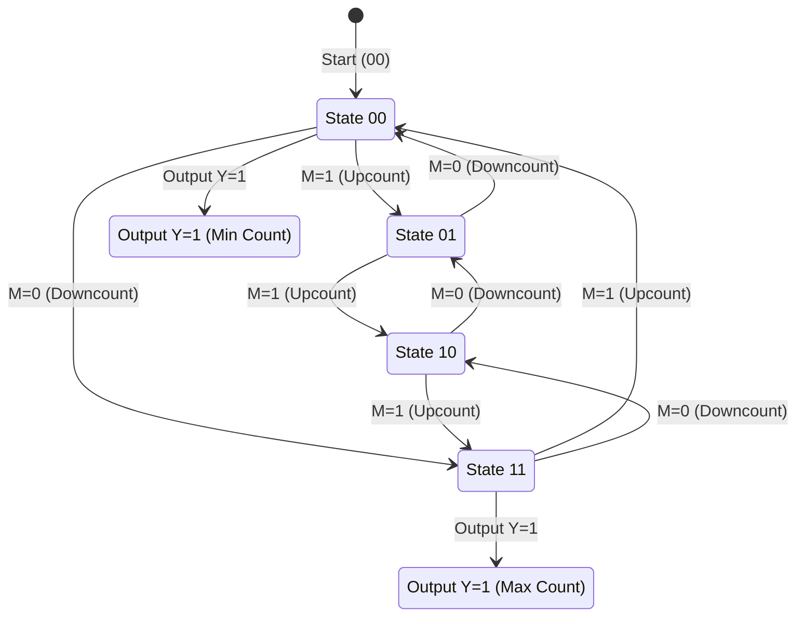

---
tags:
  - Knowledge
parent:
  - "[[Digital Electronics and Logic Design -]]"
Curriculum: "[[SE-Computer-Engg-2019-Patt.pdf]]"
Lab: "[[Digital Electronics Lab -]]"
created: 2024-12-08
source: https://chatgpt.com/c/67529e2d-4f5c-8006-8228-3f877b3f3f69
---
#### **Topics:**

- **Algorithmic State Machines (ASM):**
    - Finite State Machines (FSM) and ASM
    - ASM Charts and Notations
    - Construction of ASM Charts
    - Realization of Sequential Circuits
- **Programmable Logic Devices (PLDs):**
    - ROM as PLD
    - Programmable Logic Array (PLA)
    - Programmable Array Logic (PAL)
    - Designing Combinational Circuits using PLDs

### **Unit IV: Algorithmic State Machines (ASM) and Programmable Logic Devices (PLDs)**

==This unit focuses on designing sequential circuits using **ASM charts** and understanding programmable devices like ROM, PLA, and PAL for implementing combinational and sequential logic circuits.==

---

### **1\. Algorithmic State Machines (ASM)**

==ASM is a method for designing sequential circuits, especially **finite state machines (FSMs)**. It provides a structured way to represent the behavior of a sequential system.==

#### **Key Concepts:**

1. ==**Finite State Machines (FSMs):**==

- FSMs are models of systems with a finite number of states.
- There are two types:
- **Mealy Machine:** Outputs depend on the current state and inputs.
- **Moore Machine:** Outputs depend only on the current state.
2. ==**ASM Charts==

- An ASM chart is a flowchart-like representation of a sequential circuit's operation.
- It consists of:
- **State Boxes:** Represent the states of the system.
- **Decision Boxes:** Indicate conditions for state transitions.
- **Conditional Outputs:** Define output signals based on the state and inputs.

#### **Steps to Design a Sequential Circuit using ASM:**

1. ==**Define the Problem:**==

- Identify the states, inputs, and outputs of the system.
2. ==**Draw the ASM Chart:**==

- Use state boxes, decision boxes, and conditional outputs to represent the system.
3. ==**Construct the State Table:**==

- List the current states, inputs, next states, and outputs.
4. ==**Implement the Circuit:**==

- Use flip-flops (e.g., D, JK, or T) to implement the states.
- Use logic gates to implement the state transitions and outputs.

**Q] Draw an ASM Chart for 2-bit Updown counter having mode control i/p as M=1 upcounting M = 0 downcounting Ckt should give o/p y = 1 for minimum & max-count.**

### Explanation:

1. **States:**
    - `S00`, `S01`, `S10`, `S11` represent the binary states of the 2-bit counter.
2. **Transitions:**
    - `M=1`: Counter increments (Upcounting).
    - `M=0`: Counter decrements (Downcounting).
3. **Output (Y=1):**
    - Occurs at `S00` (minimum count) and `S11` (maximum count).

#### **Example: Sequence Detector**

- A sequence detector identifies a specific pattern in a sequence of inputs, like "101".
- Steps:
- Define states for the sequence (e.g., Start, 1 detected, 10 detected, 101 detected).
- Draw the ASM chart and derive state transition and output logic.
- Implement using flip-flops and logic gates.

---

### **2\. Programmable Logic Devices (PLDs)**

==PLDs are hardware components used to implement logic circuits. They can be programmed to perform specific logic functions, eliminating the need for traditional fixed-function ICs.==

#### **Types of PLDs:**

1. ==**Read-Only Memory (ROM):**==

- ==ROM== can implement any combinational circuit by predefining a truth table in its memory.
- It has fixed AND gates and programmable OR gates.
- Example: A 2-to-4 decoder can be implemented using ROM.
2. ==**Programmable Logic Array (PLA):**==

- ==PLA== has programmable AND gates and programmable OR gates.
- It offers more flexibility than ROM, allowing custom logic designs.
- Example: Implementing a binary-to-Gray code converter.
3. ==**Programmable Array Logic (PAL):**==

- ==PAL== has fixed OR gates but programmable AND gates.
- It is faster and simpler than PLA but less flexible.
- Example: Implementing a full adder circuit.

#### **Designing Circuits Using PLDs:**

1. Define the logic function (truth table).
2. Minimize the function using Karnaugh maps or Boolean algebra.
3. Program the PLD (e.g., define which AND/OR gates to use).

---

### **Key Applications:**

1. ==**Waveform Generator (Exemplar):**==

- A waveform generator can use a **multiplexer controller** to produce desired patterns or signals.
2. ==**FSM-Based Designs:**==

- Traffic light controllers.
- Sequence generators and detectors.

---

### **Summary**

- **ASM** provides a systematic way to design sequential circuits using charts and state machines.
- **PLDs** like ROM, PLA, and PAL are programmable devices for efficient implementation of logic functions.
- Together, these concepts enable the design and implementation of complex combinational and sequential circuits.

---
# **All Units list-
---
### **1 [[Unit III Sequential Logic Design]]
---
### **2 [[Unit IV Algorithmic State Machines and Programmable Logic Devices]]
---
### **3 [[Unit V Logic Families]]
---
### **4 [[Unit VI Introduction to Computer Architecture]]
---

