---
tags:
  - Knowledge
parent:
  - "[[Digital Electronics and Logic Design -]]"
Curriculum: "[[SE-Computer-Engg-2019-Patt.pdf]]"
Lab: "[[Digital Electronics Lab -]]"
---

#### **Topics:**

- **Classification of Logic Families:**
    - Unipolar Logic Families
    - Bipolar Logic Families
- **Characteristics of Digital ICs:**
    - Fan-In, Fan-Out
    - Current and Voltage Parameters
    - Noise Immunity
    - Propagation Delay
    - Power Dissipation
    - Figure of Merits
    - Operating Temperature Range
    - Power Supply Requirements
- **Transistor-Transistor Logic (TTL):**
    - Operation of TTL NAND Gate (Two-Input)
    - TTL with Active Pull-Up
    - TTL with Open Collector Output
    - Wired AND Connection
    - Tristate TTL Devices
    - TTL Characteristics
- **CMOS Technology:**
    - CMOS Inverter
    - CMOS Characteristics
    - CMOS Configurations:
        - Wired Logic
        - Open Drain Outputs

# **Digital Logic Families: Comprehensive Notes**

## **1. Classification of Logic Families**

### **Logic Family Types**

![[mermaid-diagram-2024-12-08-223735.svg]]
### **1.1 Unipolar Logic Families**

Unipolar logic families are based on devices that use **only one type of charge carrier** (either electrons or holes) for current conduction. The most common unipolar logic family is **CMOS**.

#### **Types of Unipolar Logic Families:**

- **CMOS (Complementary Metal-Oxide-Semiconductor):**
    - **Standard CMOS**: Widely used for low power consumption in digital circuits.
    - **Low Power CMOS**: Optimized for energy-saving devices.
    - **High-Speed CMOS**: Designed for fast switching operations.
    - **BiCMOS**: Combines the speed of bipolar transistors with the low power consumption of CMOS.

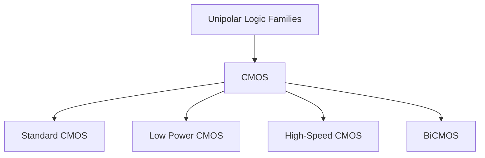

---

### **1.2 Bipolar Logic Families**

Bipolar logic families use both **electrons and holes** as charge carriers, making them faster but consuming more power compared to unipolar logic families.

#### **Types of Bipolar Logic Families:**

- **TTL (Transistor-Transistor Logic)**:
    
    - **Standard TTL**: Common general-purpose logic family.
    - **Low-Power TTL**: Variant with reduced power consumption.
    - **Schottky TTL**: Faster version using Schottky diodes.
    - **Advanced TTL**: Enhanced TTL with better speed and integration.
- **ECL (Emitter-Coupled Logic)**:
    
    - **Standard ECL**: Very fast logic family, but high power consumption.
    - **Low-Voltage ECL**: Optimized for low voltage to reduce power dissipation.
- **DTL (Diode-Transistor Logic)** and **RTL (Resistor-Transistor Logic)** are older, less commonly used bipolar families that have been mostly replaced by TTL.
    

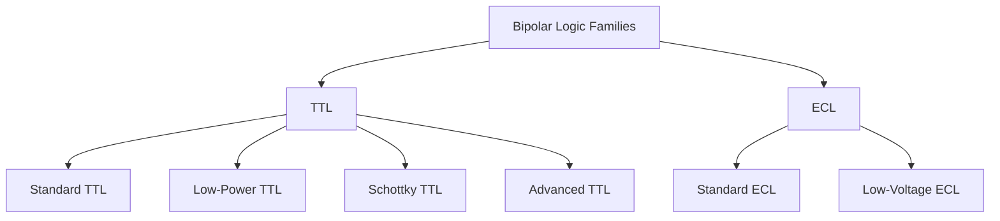

---

## **2. Characteristics of Digital ICs**

### **2.1 Fan-In and Fan-Out**

- **Fan-In**: The number of inputs that a logic gate can accept.
- **Fan-Out**: The number of standard inputs that can be driven by the output of a logic gate.

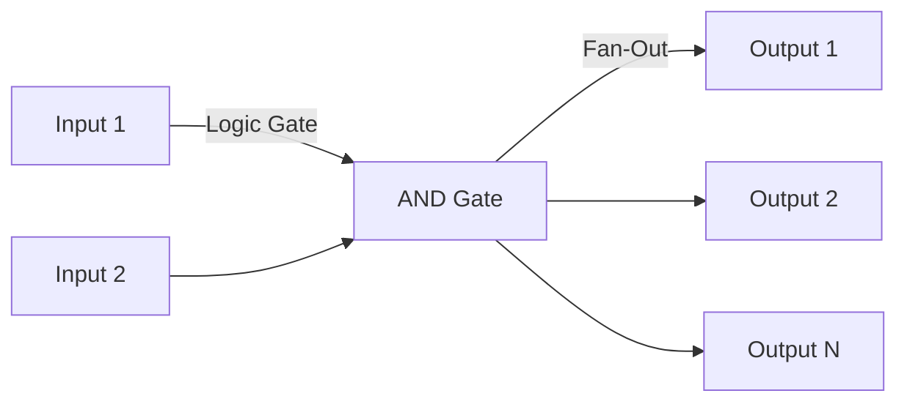

---

### **2.2 Current and Voltage Parameters**

- **Voltage Levels**: Logic gates work with specific voltage thresholds for logic "0" (low) and logic "1" (high).
- **Current**: High-current states can lead to excessive power dissipation.

---

### **2.3 Noise Immunity**

Noise immunity refers to a circuit's ability to maintain correct operation despite external electrical noise. CMOS generally has higher noise immunity than TTL.

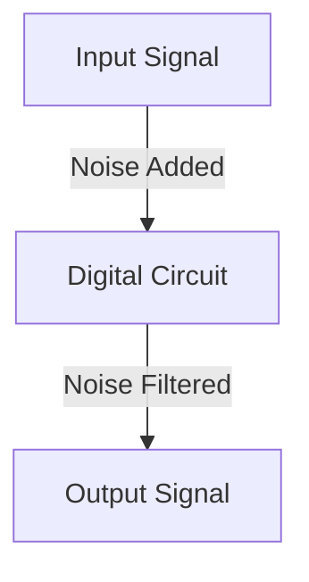

**Tip**: Higher noise immunity is achieved by increasing the **noise margin**, the difference between the signal levels for logic 0 and logic 1.

---

### **2.4 Propagation Delay**

Propagation delay is the time taken for a signal to travel through a gate from input to output.

- **Formula**: Propagation Delay=tPLH=tPHL\text{Propagation Delay} = t_{PLH} = t_{PHL} where tPLHt_{PLH} is the propagation delay for the low-to-high transition and tPHLt_{PHL} is for high-to-low.

```mermaid
gantt
    title Propagation Delay Example
    dateFormat  X
    section Signal Propagation
    Input Signal :done, a1, 0, 2
    Gate 1 Processing :done, a2, 2, 3
    Gate 2 Processing :done, a3, 5, 3
    Output Signal :done, a4, 8, 2
```

---

### **2.5 Power Dissipation**

Power dissipation refers to the amount of energy consumed by a digital IC during operation. It is a key factor in determining the efficiency of a logic family.

- **Formula for Power Dissipation**: P=Vcc×IddP = V_{cc} \times I_{dd} where PP is the power dissipation, VccV_{cc} is the supply voltage, and IddI_{dd} is the current drawn by the IC.

---

### **2.6 Figure of Merits**

A figure of merit (FoM) is used to evaluate the overall performance of a logic family. It combines parameters like speed, power, and noise immunity.

---

### **2.7 Operating Temperature Range**

The temperature range within which the logic family can reliably function. Standard logic ICs typically operate between 0°C to 70°C, while industrial ICs can operate from -40°C to 125°C.

---

### **2.8 Power Supply Requirements**

- **CMOS**: Requires low power supply voltages (3.3V to 5V).
- **TTL**: Requires higher supply voltages (5V).
- **ECL**: Requires dual power supplies (typically -5.2V and 0V).

---

## **3. Transistor-Transistor Logic (TTL)**

### **3.1 Operation of TTL NAND Gate (Two-Input)**

A **NAND gate** produces a logic "0" only when all inputs are "1". For two inputs, the operation is:

|A|B|Output (Y)|
|---|---|---|
|0|0|1|
|0|1|1|
|1|0|1|
|1|1|0|

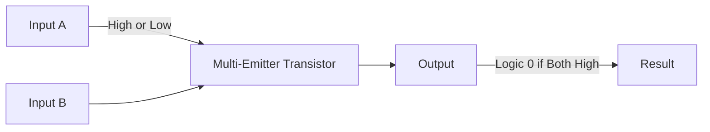

### **3.2 TTL with Active Pull-Up**

In TTL, an active pull-up resistor is used to improve the speed of the output.

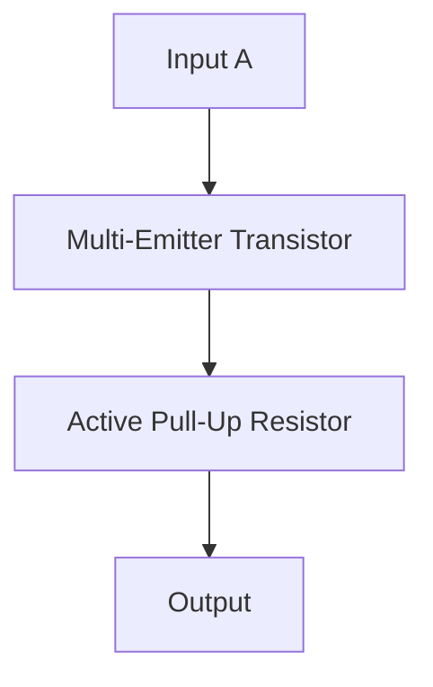

### **3.3 TTL with Open Collector Output**

This configuration allows multiple outputs to be connected together to form a logical AND function.

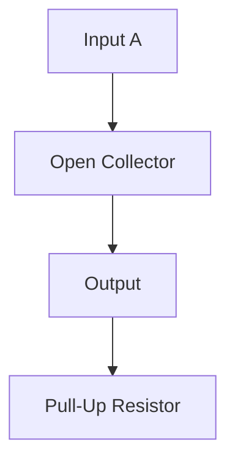

---

### **3.4 Wired AND Connection**

This method allows multiple TTL gates to share an output line, forming a logical AND function.

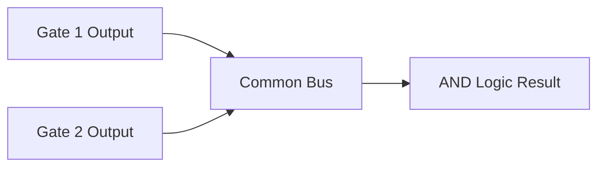

---

### **3.5 Tristate TTL Devices**

Tristate devices have an additional high-impedance state where they effectively disconnect from the circuit, allowing for shared buses.

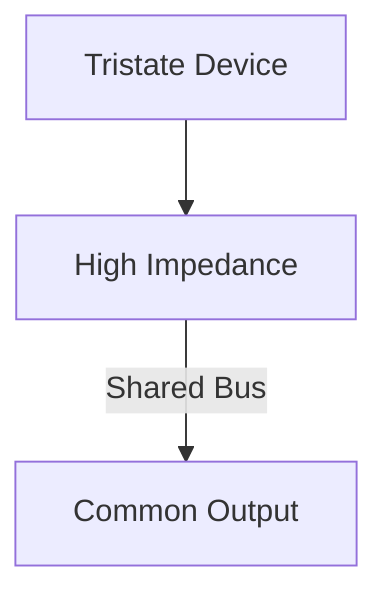

---

### **3.6 TTL Characteristics**

|**Feature**|**TTL**|
|---|---|
|**Speed**|High-speed operation|
|**Power Consumption**|Higher than CMOS|
|**Noise Immunity**|Moderate|
|**Voltage Levels**|Logic 1: 2V-5V, Logic 0: 0V-0.8V|

---

## **4. CMOS Technology**

### **4.1 CMOS Inverter**

A **CMOS inverter** consists of a **p-MOSFET** and an **n-MOSFET**. The p-MOSFET connects to the high voltage, while the n-MOSFET connects to ground.

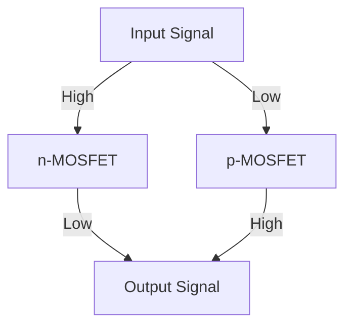

### **4.2 CMOS Characteristics**

|**Feature**|**CMOS**|**TTL**|
|---|---|---|
|**Power Consumption**|Very low during static states|Moderate to high|
|**Speed**|Slower than TTL|Faster than CMOS|
|**Noise Immunity**|Very high|Moderate|
|**Complexity**|High (requires more components)|Low|

---

### **4.3 CMOS Configurations**

#### **Wired Logic**

CMOS allows the use of **wired-AND** and **wired-OR** logic, making it possible to share common lines between devices.

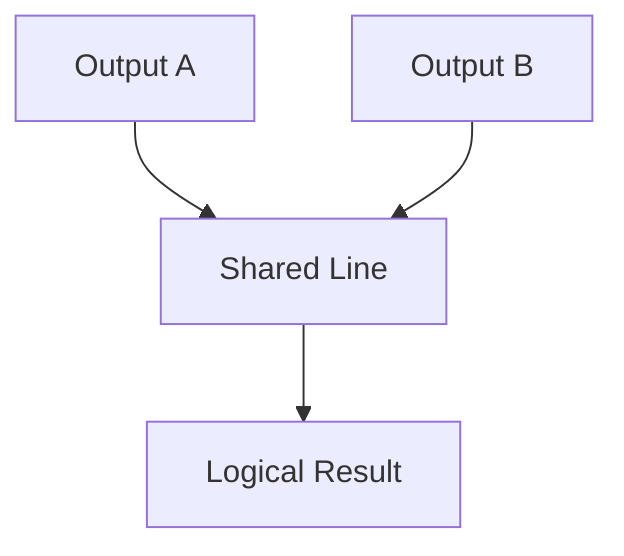

#### **Open Drain Outputs**

An **open-drain output** configuration is used to share an output line. It requires an external pull-up resistor.

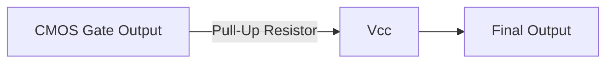

---

These notes, with **Mermaid diagrams**, **formulas**, and **tables**, should provide a comprehensive understanding of logic families, TTL, and CMOS technologies. Let me know if you'd like any specific section expanded or more examples!

---
# **All Units list-
---
### **1 [[Unit III Sequential Logic Design]]
---
### **2 [[Unit IV Algorithmic State Machines and Programmable Logic Devices]]
---
### **3 [[Unit V Logic Families]]
---
### **4 [[Unit VI Introduction to Computer Architecture]]
---

