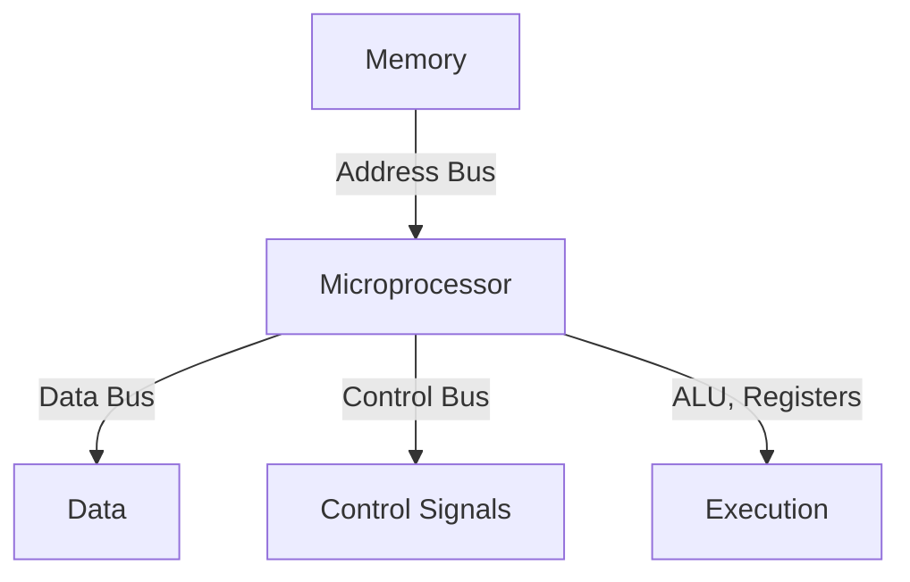
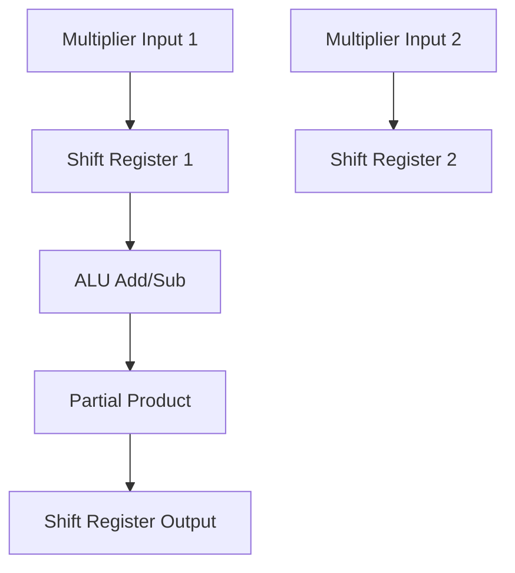
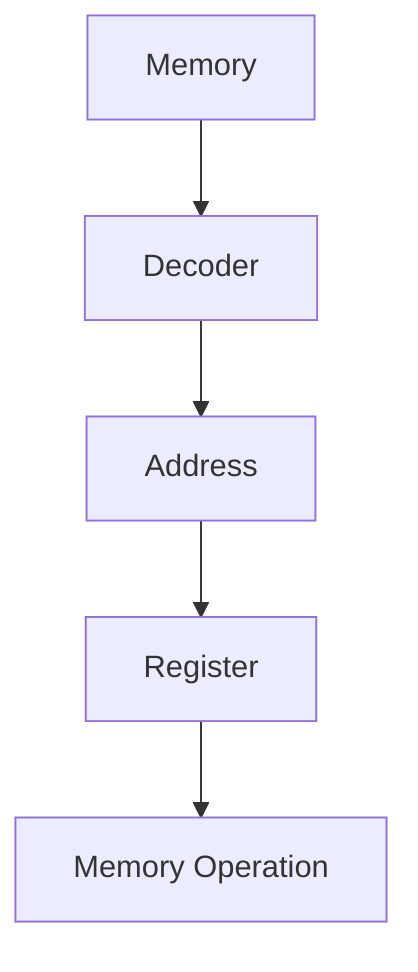
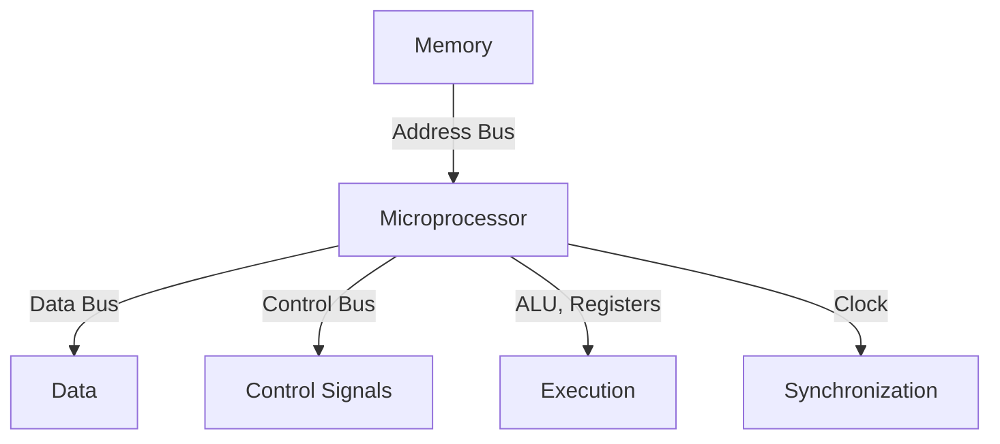

---
tags:
  - Knowledge
parent:
  - "[[Digital Electronics and Logic Design -]]"
Curriculum: "[[SE-Computer-Engg-2019-Patt.pdf]]"
Lab: "[[Digital Electronics Lab -]]"
---
## **Topics:**

- **Microprocessor Basics:**
    - Data Bus, Address Bus, Control Bus
    - Microprocessor-Based Systems
    - Basic Microprocessor Operations
    - Block Diagram of Microprocessor
- **Functional Units of Microprocessor:**
    - ALU using IC 74181
    - Basic Arithmetic Operations using ALU IC 74181
    - 4-Bit Multiplier Circuit using ALU and Shift Registers
- **Memory Organization and Operations:**
    - Digital Circuits using Decoders and Registers for Memory Operations

---
### **Unit VI: Introduction to Computer Architecture (07 Hours)**

---

### **1. Microprocessor Basics**

- **Data Bus, Address Bus, Control Bus:**
    
    - **Data Bus**: Transfers data between microprocessor and memory/I/O devices. Bidirectional.
    - **Address Bus**: Carries memory addresses. Unidirectional.
    - **Control Bus**: Manages operations (read/write, interrupt signals, clock).
- **Microprocessor-Based Systems:**
    
    - Composed of a **microprocessor**, **memory**, and **I/O devices**.
    - Microprocessor processes instructions and controls operations.
- **Basic Microprocessor Operations:**
    
    1. **Fetch**: Instruction is fetched from memory.
    2. **Decode**: Instruction is decoded to identify the operation.
    3. **Execute**: Operation is performed by the microprocessor.
- **Block Diagram of Microprocessor:**
    
    - Includes **ALU**, **Registers**, **Control Unit**, **Data Bus**.

---

### **2. Functional Units of Microprocessor**

- **ALU Using IC 74181:**
    
    - Performs arithmetic and logical operations.
    - **IC 74181**: 4-bit ALU, handles addition, subtraction, AND, OR, XOR, etc.
- **Basic Arithmetic Operations Using ALU IC 74181:**
    
    - **Addition/Subtraction**: Using control inputs to select operations.
    - **Logical Operations**: AND, OR, XOR using corresponding control lines.
- **4-Bit Multiplier Circuit Using ALU and Shift Registers:**
    
    - Multiplication of two 4-bit numbers using ALU for addition and shift registers for handling partial products.

---

### **3. Memory Organization and Operations**

- **Digital Circuits Using Decoders and Registers for Memory Operations:**
    - **Decoders**: Used to select memory addresses.
    - **Registers**: Store data temporarily during memory operations (read/write).

---

<h1 style="font-size:2em;color:red">Unit VI: Introduction to Computer Architecture (in-Depth)</h1>

---

### **1. Microprocessor Basics**

#### **Key Concepts:**

- **Data Bus, Address Bus, Control Bus:**
    
    - **Data Bus:**
        
        - A set of parallel lines used to transfer data between the microprocessor, memory, and I/O devices.
        - **Bidirectional**: Data can travel in both directions (from microprocessor to memory and vice versa).
    - **Address Bus:**
        
        - Carries the address to/from memory locations.
        - **Unidirectional**: Address is sent from the microprocessor to memory or I/O devices.
    - **Control Bus:**
        
        - Controls the operation of the system by carrying signals like **read/write**, **interrupts**, **clock signals**, and **status signals**.
        - It helps to determine the type of operation taking place (reading from memory, writing to memory, etc.).
- **Microprocessor-Based Systems:**
    
    - **Microprocessor**: The central processing unit (CPU) responsible for executing instructions.
    - **Memory**: Stores data and instructions (RAM, ROM).
    - **I/O Devices**: Allow interaction with external systems (e.g., keyboards, displays, sensors).
    - The microprocessor coordinates communication between memory and I/O through buses.
- **Basic Microprocessor Operations:**
    
    1. **Fetch**: The microprocessor fetches an instruction from memory.
    2. **Decode**: The fetched instruction is decoded to understand the operation.
    3. **Execute**: The microprocessor executes the operation (ALU performs arithmetic or logic operations, or data is moved between memory and registers).
- **Block Diagram of Microprocessor:**
    
    - **Control Unit (CU)**: Manages the operation of the microprocessor by sending control signals.
    - **ALU (Arithmetic Logic Unit)**: Performs all arithmetic and logic operations.
    - **Registers**: Temporary storage within the microprocessor for data and instructions.
    - **Clock**: Synchronizes the timing of operations.
    - **Buses (Data, Address, Control)**: Facilitate communication between different components.

---

### **2. Functional Units of Microprocessor**

#### **Key Concepts:**

- **ALU Using IC 74181:**
    
    - **ALU (Arithmetic Logic Unit)**: The component that performs arithmetic (addition, subtraction, multiplication) and logical (AND, OR, XOR) operations in the microprocessor.
    - The **74181** is a 4-bit ALU IC that performs operations like addition, subtraction, AND, OR, and XOR based on input control signals.
    - It has:
        - **A and B inputs**: 4-bit data inputs.
        - **Control Inputs**: Used to select the desired operation.
        - **Carry-In/Carry-Out**: For handling multi-bit operations like addition and subtraction.
- **Basic Arithmetic Operations Using ALU IC 74181:**
    
    - **Addition**: The ALU adds two 4-bit numbers.
    - **Subtraction**: The ALU subtracts one 4-bit number from another.
    - **Logical Operations**: AND, OR, XOR operations on 4-bit inputs, controlled by control lines.
- **4-Bit Multiplier Circuit Using ALU and Shift Registers:**
    
    - **4-Bit Multiplication**:
        - The multiplier uses a combination of the ALU and shift registers.
        - The ALU adds the partial products generated by the multiplier.
        - **Shift Registers** are used to shift the partial products during the multiplication process, ensuring proper alignment for addition.

---

### **3. Memory Organization and Operations**

#### **Key Concepts:**

- **Digital Circuits Using Decoders and Registers for Memory Operations:**
    
    - **Memory Organization**: The microprocessor's memory is organized in addressable units. Each unit can be read from or written to.
        
    - **Decoder**:
        
        - A decoder is used to select a specific memory address based on the address bus.
        - For example, a **3-to-8 decoder** could select one of eight memory locations based on a 3-bit address input.
    - **Registers**:
        
        - **Temporary storage** for data being processed. Registers are used to hold data being read from or written to memory.
        - **Memory Operations**: In a memory operation, data is fetched from memory into a register or written from a register into memory.
- **Example of Memory Operation**:
    
    - **Read Operation**: The microprocessor sends an address to the decoder, which activates the corresponding memory location. The data from that location is then transferred to a register via the data bus.
    - **Write Operation**: Data from a register is placed onto the data bus, and the decoder selects the memory location where the data is to be written.

---

### **Summary of Unit VI Concepts:**

1. **Microprocessor Architecture** involves components like ALU, registers, control unit, and buses.
2. **Functional Units** of a microprocessor handle arithmetic, logic operations (ALU), and data storage (Registers).
3. **Memory Operations** are managed through decoders and registers, enabling read/write functionality.
4. **IC 74181** is a key ALU used for performing basic arithmetic and logical operations within the processor.

This detailed overview should help in better understanding the structure and operation of microprocessors!

# NOBSPARA

### **Unit VI: Introduction to Computer Architecture (07 Hours)**

In this unit, the focus is on understanding the architecture and operation of a microprocessor, which is central to most modern computing systems. A **microprocessor-based system** consists of a microprocessor, memory, and input/output (I/O) devices, with communication between these components facilitated by three main buses: the **Data Bus**, the **Address Bus**, and the **Control Bus**.

- **Data Bus**: This bidirectional bus transfers data between the microprocessor and other components (like memory or I/O devices).
- **Address Bus**: This unidirectional bus carries the memory address from the microprocessor to memory or I/O devices.
- **Control Bus**: This bus carries control signals that direct the operation of the system, such as **read/write** commands, clock signals, and interrupt signals.

The **microprocessor** itself contains various components:

- **ALU (Arithmetic Logic Unit)**: It performs arithmetic and logical operations.
- **Registers**: Temporary storage locations for data that the microprocessor is currently processing.
- **Control Unit**: Directs the operation of the microprocessor by sending control signals to other components.
- **Clock**: Provides synchronization for the entire system.

The microprocessor operates in three basic stages: **fetching** an instruction from memory, **decoding** the instruction to understand what action is needed, and **executing** the instruction by performing the necessary operations.

One key functional unit in microprocessors is the **ALU**. For example, the **74181 ALU** is a 4-bit ALU that performs various arithmetic (addition, subtraction) and logical (AND, OR, XOR) operations. The microprocessor can use this ALU for both simple operations like addition and more complex tasks such as multiplying two numbers using the ALU and **shift registers**. The shift registers temporarily hold values and shift the bits during operations, ensuring that the intermediate partial products in multiplication are correctly aligned.

In terms of **memory organization**, the microprocessor uses **decoders** to select memory addresses and **registers** to temporarily store data being read from or written to memory. A **decoder** translates an address from the microprocessor into a specific memory location, and **registers** store data being processed.

Overall, this unit emphasizes the integration of the microprocessor's components and the role of buses, ALUs, shift registers, and memory in performing operations. The use of these components allows the microprocessor to execute complex tasks efficiently, making it the central component of modern digital systems.

---
# **All Units list-
---
### **1 [[Unit III Sequential Logic Design]]
---
### **2 [[Unit IV Algorithmic State Machines and Programmable Logic Devices]]
---
### **3 [[Unit V Logic Families]]
---
### **4 [[Unit VI Introduction to Computer Architecture]]
---

