---
tags:
  - COMPUTER
Year: "2024"
Curriculum: "[[SE-Computer-Engg-2019-Patt.pdf]]"
Semester: "[[SE SEM 1]]"
Course: Computer
Lab: "[[Digital Electronics Lab -]]"
Major: "[[Digital Electronics and Logic Design -]]"
---
# **Computer Science [[SE SEM 1]] : Digital Electronics and Logic Design Syllabus -** 
## **Unit I: Fundamentals of Logic Minimization (6 Hours)**

- **Logic Design Minimization:** Techniques for reducing the complexity of Boolean expressions (fewer gates)
- **K-Map Method:** Graphical method for simplifying Boolean functions with up to four variables
    - Minimization rules for grouping terms on a K-map
    - Identifying prime implicants and essential prime implicants
    - Representing SOP (Sum-Of-Products) and POS (Product-Of-Sums) forms on K-maps
- **Quine-McClusky Method (Optional):** Tabular method for simplifying Boolean functions with any number of variables (more complex than K-map for smaller functions)

**Exemplar/Case Studies:**

- **Digital Locks using Logic Gates:** Design a simple combination lock circuit using AND, OR, and NOT gates.
- **Mapping of Course Outcomes for Unit I (CO1):** Link learning objectives to specific logic minimization concepts covered.

## **Unit II: Combinational Logic Design (6 Hours)**

- **Number Systems:**
    - Binary code (standard representation for digital circuits)
    - BCD (Binary Coded Decimal)
    - Excess-3 (used for error correction)
    - Gray code (used for minimizing glitches)
- **Combinational Circuits:**
    - Half Adder and Full Adder: Circuits for performing binary addition
    - Half Subtractor and Full Subtractor: Circuits for performing binary subtraction
    - Binary Adder (IC 7483): Integrated circuit implementation of a full adder
    - BCD Adder: Designing an adder circuit for BCD numbers
    - Look-Ahead Carry Generator: Optimizing carry propagation in adders
- **Multiplexers (MUX):**
    - MUX functionality (selecting one of multiple data inputs based on control signals)
    - Common MUX ICs (e.g., 74153, 74151)
    - Cascading multiplexers for handling larger data sizes
- **Demultiplexers (DEMUX) / Decoders:**
    - DEMUX functionality (distributing data to one of multiple outputs based on control signals)
    - Common DEMUX ICs (e.g., 74138, 74154)
    - Implementing SOP and POS expressions using multiplexers
- **Comparators (2-bit):** Circuits for comparing binary numbers
- **Parity Generators and Checkers:** Techniques for error detection in data transmission

**Exemplar/Case Studies:**

- **Combinational Logic Design of BCD to 7-Segment Display Controller:** Design a circuit to convert BCD data to the appropriate pattern for driving a 7-segment display.
- **Mapping of Course Outcomes for Unit II (CO1, CO2):** Link learning objectives to specific combinational logic design concepts covered.

**Note:**

- Removed redundant information about signed number representations (sign-magnitude, 1's complement, 2's complement) as it's not directly relevant to logic minimization and combinational design.
- Highlighted optional material (Quine-McClusky Method).
- Maintained the original structure and learning objective mapping placeholders.

## **[[Unit III Sequential Logic Design]] (6 Hours)**

- **Flip-Flops:** Fundamental building blocks of sequential circuits
    - SR Flip-Flop: Set-Reset behavior with truth table and excitation table
    - JK Flip-Flop: Universal flip-flop with various triggering conditions (J=K=1 for toggle)
    - D Flip-Flop: Data latch with transparent data input
    - T Flip-Flop: Toggle flip-flop with truth table and excitation table
- **Flip-Flop Properties:**
    - Preset and Clear inputs for asynchronous setting or resetting
    - Master-Slave JK Flip-Flops: Improved design for eliminating race conditions
- **Analysis and Conversion:**
    - Understanding flip-flop behavior using truth tables and excitation tables
    - Techniques for converting between different types of flip-flops

**Registers:** Circuits for storing and manipulating binary data

- **Shift Registers:** Sequential circuits for shifting data bits in a specific direction
    - SISO (Serial-In, Serial-Out)
    - SIPO (Serial-In, Parallel-Out)
    - PISO (Parallel-In, Serial-Out)
    - PIPO (Parallel-In, Parallel-Out)
    - Bidirectional Shift Registers
- **Counters:** Circuits that generate a sequence of digital codes
    - Ring Counter: Circular counting behavior
    - Universal Shift Register Counters
    - Asynchronous Counters: Ripple counters with propagation delays
    - Synchronous Counters: Counters with simultaneous state changes at the clock edge
        - BCD Counter (for decimal counting)
        - Johnson Counter (modified ring counter with a specific sequence)
- **Modulus of the Counter (IC 7490):** Determining the maximum count value of a counter

**Sequential Circuit Design:**

- **Models:** Moore and Mealy models for representing sequential circuits
- **State Diagrams and State Tables:** Graphical and tabular representations of circuit behavior
- **Design Procedure:** Steps for designing a sequential circuit based on specifications

**Exemplar/Case Studies:**

- **Electronic Voting Machine (EVM):** Analyze the use of sequential logic circuits in controlling the voting process and data storage.
- **Mapping of Course Outcomes for Unit III (CO2, CO3):** Link learning objectives to specific sequential logic design concepts covered.

## **[[Unit IV Algorithmic State Machines and Programmable Logic Devices]] (6 Hours)**

- **Algorithmic State Machines (ASM):** High-level abstraction for modeling sequential circuits
- **Finite State Machines (FSM):** Foundation for ASMs, representing state transitions
- **ASM Charts and Notations:** Visual representation of ASM behavior
- **Construction of ASM Charts:** Translating problem specifications into ASM diagrams
- **Realization for Sequential Circuits:** Implementing ASMs using flip-flops and logic gates

**Programmable Logic Devices (PLDs):** Hardware components that can be programmed to perform specific logic functions

- **Types of PLDs:**
    - ROM (Read-Only Memory) as a simple PLD
    - Programmable Logic Array (PLA)
    - Programmable Array Logic (PAL)
- **Designing Combinational Circuits using PLDs:** Implementing logic functions using pre-defined structures within PLDs

**Exemplar/Case Studies:**

- **Waveform Generator using MUX Controller Method:** Design a circuit that generates specific waveforms using a multiplexer controlled by a sequential circuit.
- **Mapping of Course Outcomes for Unit IV (CO2, CO3, CO4):** Link learning objectives to specific ASM and PLD concepts covered.

## **[[Unit V Logic Families]] (6 Hours)**

- **Classification of Logic Families:** Understanding different types of digital circuits based on their implementation
    - Unipolar Logic Families (use a single type of charge carrier)
    - Bipolar Logic Families (use both electrons and holes)
- **Characteristics of Digital ICs:** Key parameters for evaluating digital integrated circuits
    - Fan-in: Number of inputs a gate can handle
    - Fan-out: Number of outputs a gate can drive reliably
    - Current and voltage parameters (power consumption)
    - Noise immunity: Resistance to electrical noise
    - Propagation Delay: Time taken for a signal to change state
    - Power Dissipation: Amount of power consumed by a circuit
    - Figure of Merit: Metric combining propagation delay and power consumption
    - Operating Temperature Range: Environmental limitations for reliable operation
    - Power Supply Requirements: Voltage and current specifications for powering the circuit
- **Transistor-Transistor Logic (TTL):** A popular bipolar logic family
    - Operation of TTL NAND Gate (Two Inputs): Understanding the basic building block of TTL circuits
    - Variations:
        - TTL with active pull-up
        - TTL with open collector output
        - Wired-AND Connection (special case for AND operation)
        - Tristate TTL Devices (gates with three output states)
- **CMOS (Complementary Metal-Oxide-Semiconductor):** A widely used logic family based on MOSFETs
    - CMOS Inverter: Fundamental building block of CMOS circuits
    - CMOS Characteristics: Advantages and limitations compared to TTL
    - CMOS Configurations:
        - Wired Logic (similar concept to TTL)
        - Open Drain Outputs (similar functionality to TTL)

**Exemplar/Case Studies:**

- **Study the design of various basic gates using TTL/CMOS logic families:** Analyze the implementation of common logic gates (AND, OR, NOT, etc.) in both TTL and CMOS technologies.
- **Mapping of Course Outcomes for Unit V (CO3):** Link learning objectives to specific logic family concepts covered.

## **[[Unit VI Introduction to Computer Architecture]] (6 Hours)**

- **Building Blocks of a Computer:** High-level overview of the functional units within a microprocessor
    - Data Bus: Transfers data between components
    - Address Bus: Specifies the memory location for data access
    - Control Bus: Carries control signals for coordinating operations
- **Microprocessor-Based Systems:** Understanding how microprocessors are used in practical applications
    - Basic Operation: Fetch-decode-execute cycle
    - Block Diagram of a Microprocessor: High-level view of the internal structure
- **Functional Units of a Microprocessor:**
    - Arithmetic Logic Unit (ALU): Performs arithmetic and logical operations (often implemented using an IC like 74181)
        - Basic Arithmetic Operations using ALU IC 74181 (demonstrate addition, subtraction, etc.)
    - Multiplier Circuit: Implementing multiplication using ALU and shift registers (optional)
- **Memory Organization and Operations:**
    - Memory hierarchy and addressing schemes
    - Using decoders and registers to design circuits for memory read/write operations

**Exemplar/Case Studies:**

- **Microprocessor-Based System in Communication/Instrumentation Control:** Explore real-world applications of microprocessors in these fields (e.g., communication controllers, industrial automation systems).
- **Mapping of Course Outcomes for Unit VI (CO2, CO3, CO6):** Link learning objectives to specific computer architecture concepts covered.


### **Exam Paper Pattern Table for Digital Electronics and Logic Design**

Based on the provided exam papers, here is a consolidated **table of question patterns** with topic-wise **marks distribution** for the subject.

| **Question No.** | **Topic**                          | **Subtopics**                                              | **Marks** |
| ---------------- | ---------------------------------- | ---------------------------------------------------------- | --------- |
| **Q1 (a)**       | Flip-Flops                         | Applications, Master-Slave JK Flip-Flop, Excitation Tables | 6         |
| **Q1 (b)**       | Shift Registers                    | Types, Applications                                        | 6         |
| **Q1 (c)**       | Counters                           | 3-bit Asynchronous Down Counter with Timing Diagram        | 6         |
| **Q2 (a)**       | Flip-Flops                         | Conversion (e.g., SR to JK, JK to D, etc.)                 | 6         |
| **Q2 (b)**       | Counters                           | Sequence Generator, MOD Counters (e.g., MOD-24)            | 6         |
| **Q2 (c)**       | Counters                           | Ring Counter                                               | 6         |
| **Q3 (a)**       | Programmable Devices (PLA, PAL)    | General Structure of PLA                                   | 6         |
| **Q3 (b)**       | Programmable Devices (PAL)         | Boolean Function Implementation (e.g., F(A, B, C, D))      | 6         |
| **Q3 (c)**       | ASM Charts                         | State Diagram, State Table, ASM Chart for 2-bit Counters   | 5         |
| **Q4 (a)**       | ASM Charts                         | Definition, Components, Design Examples                    | 6         |
| **Q4 (b)**       | Programmable Devices (PAL)         | BCD to Excess-3 Code Converter                             | 6         |
| **Q4 (c)**       | Logic Families                     | Comparison of PAL and PLA                                  | 5         |
| **Q5 (a)**       | Logic Families                     | TTL NAND Gate (Operation)                                  | 6         |
| **Q5 (b)**       | Logic Families                     | Noise Margin, Power Dissipation, Propagation Delay         | 6         |
| **Q5 (c)**       | CMOS Technology                    | CMOS Inverter                                              | 6         |
| **Q6 (a)**       | Logic Families                     | Comparison of TTL and CMOS Logic Families                  | 6         |
| **Q6 (b)**       | Logic Families                     | Wired Logic Output of TTL with Diagrams                    | 6         |
| **Q6 (c)**       | CMOS Technology                    | CMOS Characteristics                                       | 6         |
| **Q7 (a)**       | Microprocessor Basics              | System Bus (Address, Data, Control)                        | 6         |
| **Q7 (b)**       | Microprocessor Basics              | ALU (IC 74181)                                             | 6         |
| **Q7 (c)**       | Microprocessor Memory Organization | Memory Architecture of Microprocessors                     | 5         |
| **Q8 (a)**       | Microprocessor Basics              | Definition and Applications of Microprocessors             | 6         |
| **Q8 (b)**       | Microprocessor ALU                 | Basic Arithmetic Operations Using IC 74181                 | 6         |
| **Q8 (c)**       | Microprocessor Buses               | Address Bus, Data Bus, Control Bus                         | 5         |

---

### **Marks Distribution Analysis**

- **Flip-Flops**: ~18 marks
- **Counters**: ~18 marks
- **Programmable Devices (PLA, PAL)**: ~17 marks
- **ASM Charts**: ~11 marks
- **Logic Families & CMOS**: ~24 marks
- **Microprocessor Basics**: ~23 marks

### **Note**

This pattern is derived from the recurring topics across the uploaded papers. Let me know if you'd like this organized further into specific sections or enhanced with additional details!


### **Flip-Flops: Comprehensive Questions and Answers**

---

### **1. Theory-Based Questions**

#### **Q1) What are the advantages of a Master-Slave JK Flip-Flop? Explain its working with a diagram.**

- **Advantages**:
    
    1. Eliminates the race-around condition found in basic JK Flip-Flops.
    2. Provides stable outputs by using the master-slave configuration.
    3. Suitable for sequential circuit applications like counters and registers.
- **Working**:
    
    - A Master-Slave JK Flip-Flop consists of two stages:
        - **Master Stage**: Captures the input on the rising edge of the clock.
        - **Slave Stage**: Produces output on the falling edge of the clock.
    - When the clock is high, the master stage is active, and the slave stage is inactive. When the clock is low, the slave stage becomes active, ensuring no feedback loops.

**Diagram**:

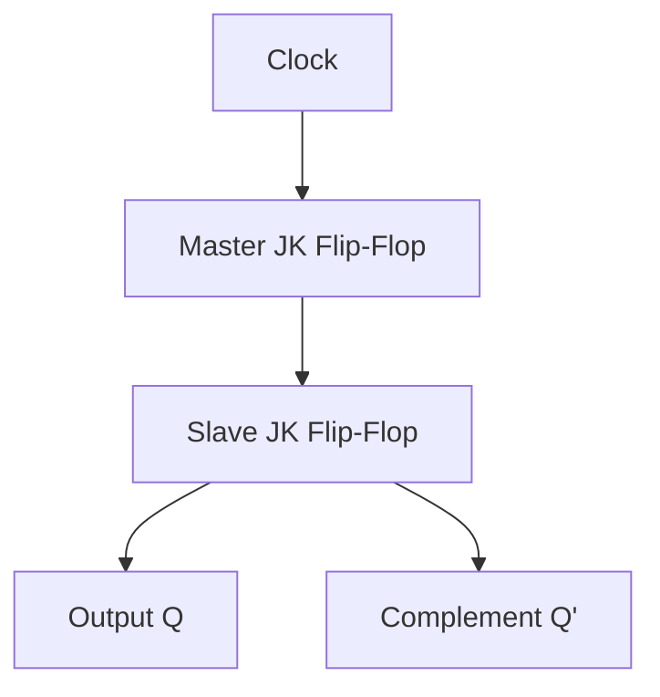

---

#### **Q2) What is a sequential circuit? Explain the excitation table of a JK Flip-Flop.**

- **Sequential Circuit**:  
    A sequential circuit is a type of digital circuit whose output depends on both the current input and the past states (stored information). Flip-Flops are key building blocks of sequential circuits.
    
- **Excitation Table of JK Flip-Flop**:  
    The excitation table defines the required input conditions (J and K) to achieve a specific transition from the current state QQ to the next state Q′Q'.
    

|QQ|Q′Q'|JJ|KK|
|---|---|---|---|
|0|0|0|X|
|0|1|1|X|
|1|0|X|1|
|1|1|X|0|

---

#### **Q3) Explain SR Flip-Flop and JK Flip-Flop using NOR gates.**

- **SR Flip-Flop using NOR Gates**:
    - **Inputs**: S (Set), R (Reset).
    - **Operation**:
        - S=1,R=0S = 1, R = 0: Set Q=1Q = 1.
        - S=0,R=1S = 0, R = 1: Reset Q=0Q = 0.
        - S=0,R=0S = 0, R = 0: No change.
        - S=1,R=1S = 1, R = 1: Invalid state.

**Diagram**:

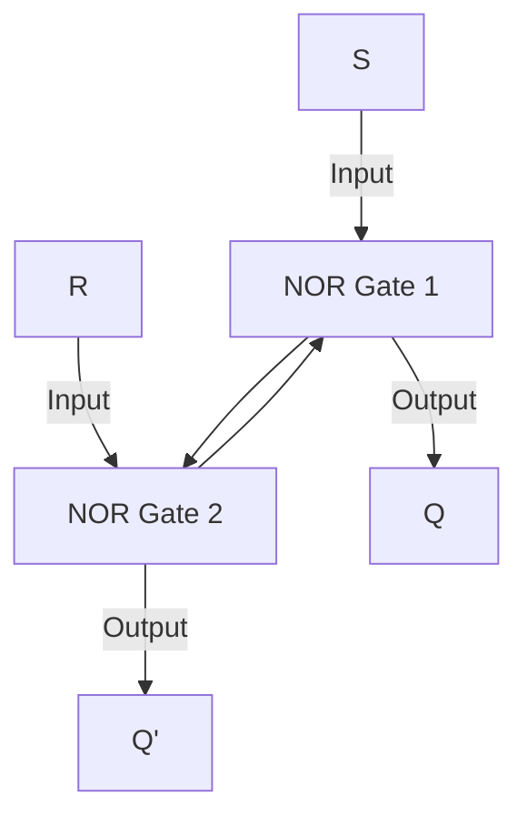

- **JK Flip-Flop using NOR Gates**:
    - Similar to the SR Flip-Flop but avoids the invalid state by toggling QQ when J=1J = 1 and K=1K = 1.

---

### **2. Conversion of Flip-Flops**

#### **Q4) Convert SR Flip-Flop to JK Flip-Flop.**

To convert an SR Flip-Flop into a JK Flip-Flop, use the following logic for inputs SS and RR:

- S=J⋅Q′S = J \cdot Q'
- R=K⋅QR = K \cdot Q

**Diagram**:

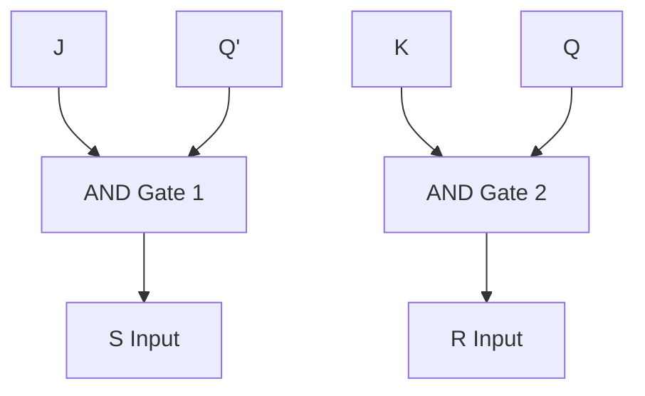

---

#### **Q5) Convert JK Flip-Flop to D Flip-Flop.**

To convert a JK Flip-Flop into a D Flip-Flop:

- J=DJ = D
- K=D‾K = \overline{D}

**Truth Table**:

|DD|JJ|KK|
|---|---|---|
|0|0|1|
|1|1|0|

---

### **3. Application-Based Questions**

#### **Q6) Design a sequence detector using a Master-Slave JK Flip-Flop for the sequence 1101.**

- **Approach**:
    1. Define states: Represent each bit of the sequence (e.g., S0, S1, S2, S3).
    2. Create a state transition diagram.
    3. Use a JK Flip-Flop to implement the state transitions.

---

#### **Q7) Design a 2-bit synchronous UP counter using T Flip-Flops.**

- **Operation**: A 2-bit counter counts in binary (00, 01, 10, 11) and then resets to 00.
- **T Flip-Flop Logic**:
    - For TT: Connect T=1T = 1 for toggling.

**Truth Table**:

| Clock | Q1Q1 | Q0Q0 |
| ----- | ---- | ---- |
| 0     | 0    | 0    |
| 1     | 0    | 1    |
| 2     | 1    | 0    |
| 3     | 1    | 1    |
| Reset | 0    | 0    |
|       |      |      |

**Diagram**:

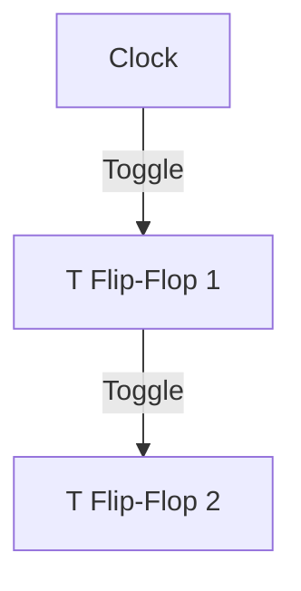

---

#### **Q8) Explain shift registers and their applications.**

- **Types**:
    
    1. **SISO (Serial-In Serial-Out)**: Data shifts one bit at a time.
    2. **SIPO (Serial-In Parallel-Out)**: Serial input with parallel output.
    3. **PISO (Parallel-In Serial-Out)**: Parallel input with serial output.
    4. **PIPO (Parallel-In Parallel-Out)**: Parallel input and output.
- **Applications**:
    
    1. Data storage.
    2. Serial-to-parallel and parallel-to-serial conversion.
    3. Ring counters and sequence generators.

---

This comprehensive Q&A list covers the **Flip-Flops topic** with explanations, tables, and diagrams for better understanding and preparation. Let me know if you'd like any specific question expanded!


### **Shift Registers: Comprehensive Questions and Answers**

---

### **1. Theory-Based Questions**

#### **Q1) What are shift registers? Explain their types and applications.**

- **Definition**:  
    Shift registers are sequential logic circuits that store and transfer data by shifting it one bit at a time, either to the left or right.
    
- **Types**:
    
    1. **Serial-In Serial-Out (SISO)**:
        
        - Data is input serially and output serially.
        - Used in data transmission systems.
    2. **Serial-In Parallel-Out (SIPO)**:
        
        - Data is input serially and output in parallel.
        - Used for converting serial data into parallel form.
    3. **Parallel-In Serial-Out (PISO)**:
        
        - Data is input in parallel and output serially.
        - Used in communication systems.
    4. **Parallel-In Parallel-Out (PIPO)**:
        
        - Data is input and output in parallel.
        - Used in temporary data storage and transfer.
- **Applications**:
    
    1. Serial-to-parallel or parallel-to-serial data conversion.
    2. Data storage and transfer.
    3. Ring counters and Johnson counters.

---

### **2. Application-Based Questions**

#### **Q2) Draw and explain a 4-bit SIPO Shift Register.**

- **Explanation**:
    - A 4-bit **Serial-In Parallel-Out (SIPO)** shift register takes serial input and provides parallel output.
    - Data is shifted one bit at a time into the register with each clock pulse. After 4 clock pulses, all bits are available in parallel.

**Diagram**:

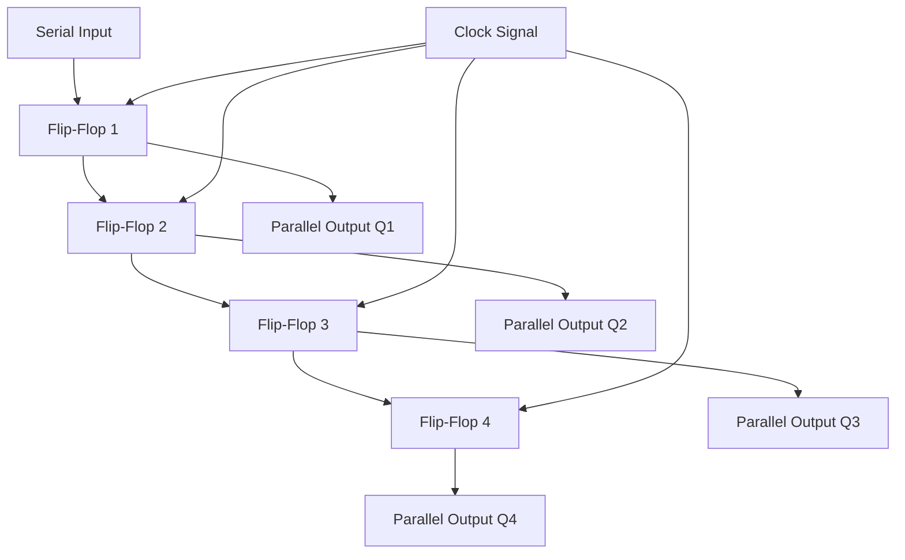

---

#### **Q3) Draw and explain a 4-bit PISO Shift Register.**

- **Explanation**:
    - A **Parallel-In Serial-Out (PISO)** shift register takes data input in parallel and outputs it serially.
    - The parallel input is loaded into the register at once. Then, on each clock pulse, one bit is shifted out serially.

**Diagram**:

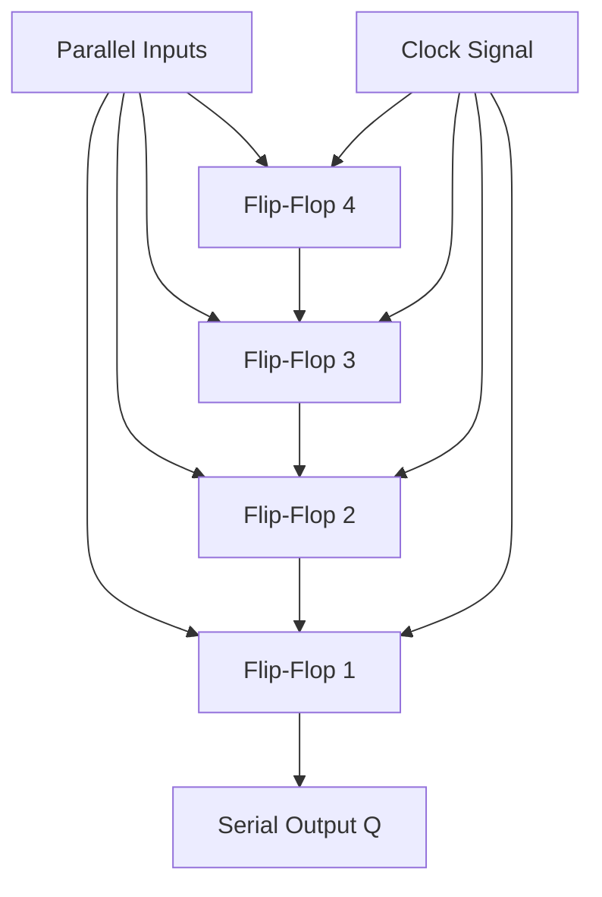

---

#### **Q4) What is a Ring Counter? Explain its operation with a diagram.**

- **Definition**:  
    A **Ring Counter** is a circular shift register where the output of the last flip-flop is fed back to the input of the first flip-flop. It circulates a single '1' or '0' through the register.
    
- **Operation**:
    
    - If the initial state is `1000`, it shifts to `0100 → 0010 → 0001 → 1000`, repeating the sequence.

**Diagram**:

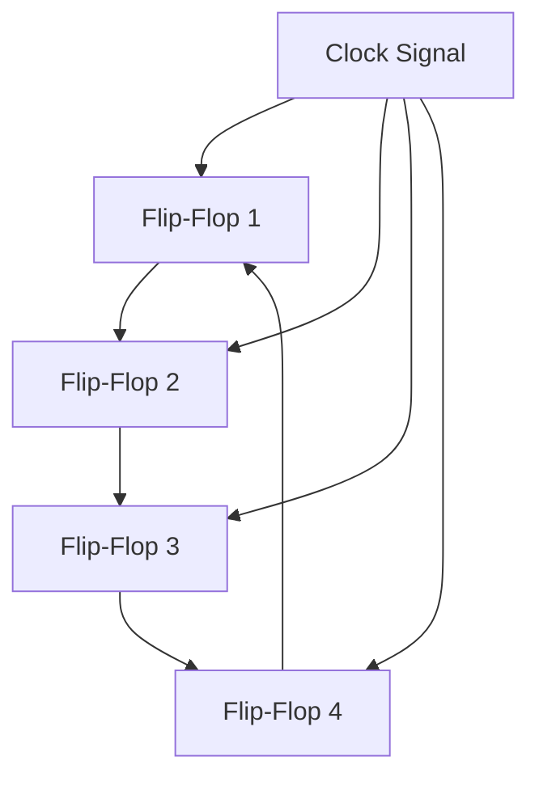

---

#### **Q5) What is a Johnson Counter? Explain with an example.**

- **Definition**:  
    A **Johnson Counter** is a modified Ring Counter where the inverted output of the last flip-flop is fed back to the first flip-flop. It generates a unique sequence of states.
    
- **Operation**:
    
    - For a 4-bit Johnson Counter, the sequence is `0000 → 1000 → 1100 → 1110 → 1111 → 0111 → 0011 → 0001 → 0000`.

**Diagram**:

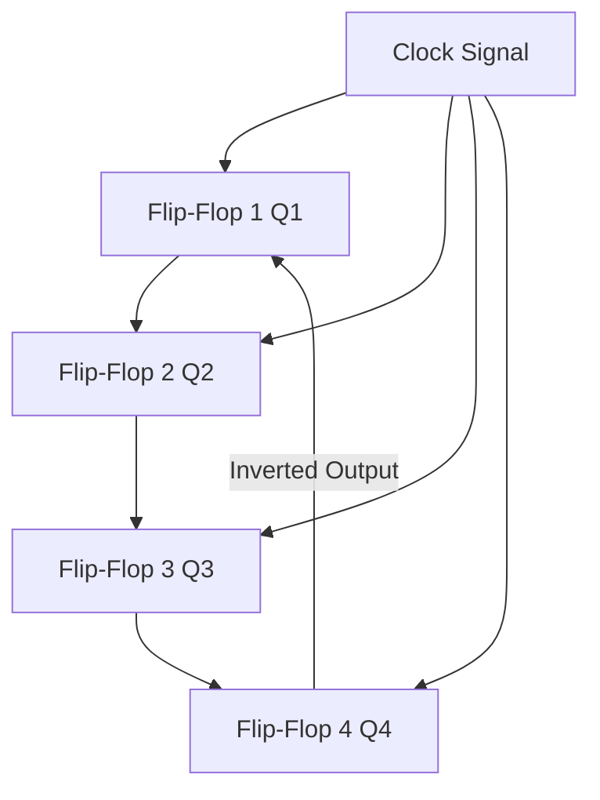

---

### **3. Comparison-Based Questions**

#### **Q6) Compare SISO, SIPO, PISO, and PIPO Shift Registers.**

|**Feature**|**SISO**|**SIPO**|**PISO**|**PIPO**|
|---|---|---|---|---|
|**Data Input**|Serial|Serial|Parallel|Parallel|
|**Data Output**|Serial|Parallel|Serial|Parallel|
|**Operation**|Shift serially|Shift serially, output parallel|Load parallel, shift serial|Load and output parallel|
|**Applications**|Data transmission|Serial-to-parallel conversion|Parallel-to-serial conversion|Data storage|

---

#### **Q7) Explain the applications of shift registers in digital systems.**

- **Applications**:
    1. **Serial-to-Parallel Conversion**: Used in communication systems to convert serial data into parallel form.
    2. **Parallel-to-Serial Conversion**: Converts parallel data into serial for transmission.
    3. **Data Storage**: Temporarily stores data during operations.
    4. **Sequence Generators**: Generates specific sequences using Ring or Johnson counters.
    5. **Arithmetic Operations**: Used in digital systems for multiplication and division.

---

This comprehensive list covers **Shift Registers** topics, including theory, design, operation, and applications, with diagrams for better visualization. Let me know if you'd like further expansions!


### **Counters: Comprehensive Questions and Answers**

---

### **1. Theory-Based Questions**

#### **Q1) What are counters? Explain their types.**

- **Definition**:  
    Counters are sequential circuits used to count pulses. They can be classified based on their clock inputs and counting sequence.
    
- **Types**:
    
    1. **Asynchronous (Ripple) Counters**:
        
        - Flip-flops are triggered by the output of the previous flip-flop (not the same clock).
        - Slower due to propagation delays.
        - Example: Ripple Up/Down Counter.
    2. **Synchronous Counters**:
        
        - All flip-flops are triggered by the same clock signal.
        - Faster and more reliable.
        - Example: Synchronous Up/Down Counter.
    3. **MOD Counters**:
        
        - Counters with a specific counting limit (MOD-n, where nn is the number of states).
        - Example: MOD-10 (BCD) Counter, MOD-12 Counter.
    4. **Ring Counters**:
        
        - A circular shift register where the output of the last flip-flop is fed to the first.
        - Example: 4-bit Ring Counter.
    5. **Johnson Counters**:
        
        - A modified Ring Counter where the inverted output of the last flip-flop is fed to the first.
        - Example: 4-bit Johnson Counter.

---

### **2. Application-Based Questions**

#### **Q2) Compare Asynchronous and Synchronous Counters.**

|**Feature**|**Asynchronous Counter**|**Synchronous Counter**|
|---|---|---|
|**Clock Input**|Each flip-flop triggered by the output of the previous flip-flop.|All flip-flops triggered by the same clock.|
|**Speed**|Slower due to ripple effect.|Faster as all flip-flops toggle simultaneously.|
|**Design**|Simple and fewer gates required.|Complex due to simultaneous triggering.|
|**Propagation Delay**|Accumulates with each flip-flop.|Constant for all flip-flops.|

---

#### **Q3) Draw and explain a 3-bit Asynchronous Down Counter using JK Flip-Flops.**

- **Explanation**:
    - A 3-bit Asynchronous Down Counter counts in reverse binary order (7 → 6 → 5 → 4 → 3 → 2 → 1 → 0).
    - Each flip-flop toggles on the falling edge of the previous flip-flop's output.

**Truth Table**:

|Clock|Q2Q2|Q1Q1|Q0Q0|
|---|---|---|---|
|0|1|1|1|
|1|1|1|0|
|2|1|0|1|
|3|1|0|0|
|4|0|1|1|

**Diagram**:

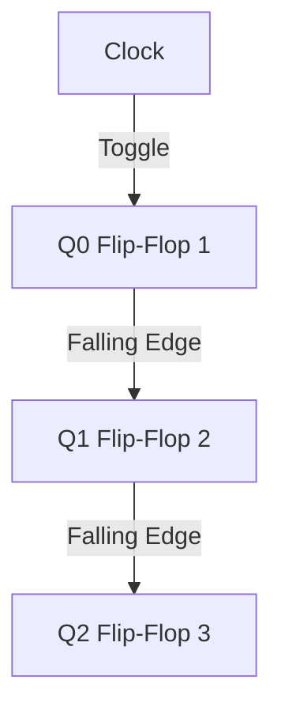

---

#### **Q4) Design a 4-bit Synchronous Up Counter using T Flip-Flops.**

- **Explanation**:
    - A Synchronous Up Counter increments in binary (0 → 1 → 2 → 3 → ... → 15).
    - Each flip-flop toggles based on the ANDed output of all previous flip-flops.

**Truth Table**:

|Clock|Q3Q3|Q2Q2|Q1Q1|Q0Q0|
|---|---|---|---|---|
|0|0|0|0|0|
|1|0|0|0|1|
|2|0|0|1|0|
|...|...|...|...|...|
|15|1|1|1|1|

**Diagram**:

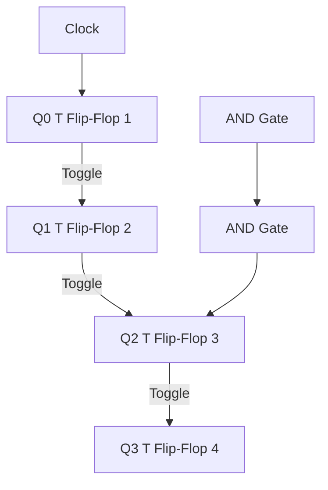

---

#### **Q5) What is a MOD Counter? Design a MOD-10 Counter using 7490.**

- **Definition**:  
    A MOD Counter counts up to a specific number of states (MOD-n) before resetting to 0. For example, a MOD-10 Counter counts from 0 to 9.
    
- **Design**:
    
    - Use IC 7490 (a BCD decade counter) for MOD-10 counting.
    - Connect the outputs QD,QC,QB,QAQD, QC, QB, QA to represent the binary count.

**Truth Table (MOD-10)**:

|Clock|QDQD|QCQC|QBQB|QAQA|
|---|---|---|---|---|
|0|0|0|0|0|
|1|0|0|0|1|
|2|0|0|1|0|
|...|...|...|...|...|
|9|1|0|0|1|
|Reset|0|0|0|0|

**Diagram**:

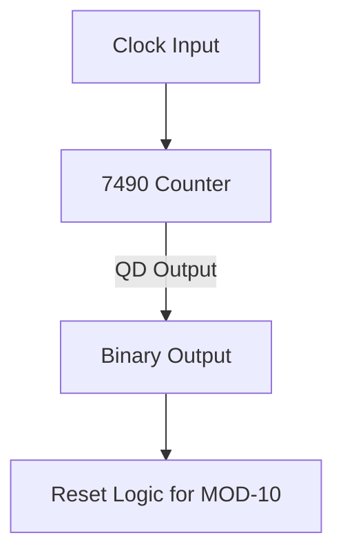

---

### **3. Sequence Generators**

#### **Q6) Design a Sequence Generator for the Sequence 1 → 3 → 5 → 7 → 1.**

- **Approach**:
    1. Represent the sequence in binary: 1 (0001), 3 (0011), 5 (0101), 7 (0111).
    2. Use a 3-bit counter with custom combinational logic for the desired transitions.

**State Table**:

|Present State|Next State|T2T2|T1T1|T0T0|
|---|---|---|---|---|
|001|011|0|1|1|
|011|101|1|0|1|
|101|111|1|1|0|
|111|001|0|0|1|

**Diagram**:

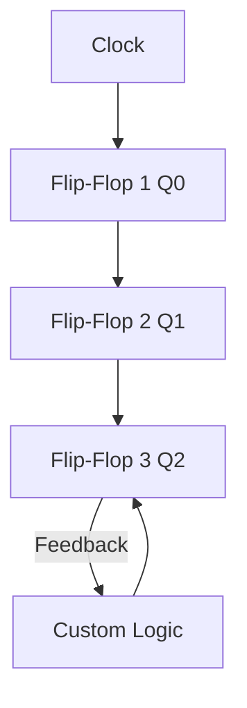

---

This comprehensive list covers **Counters** topics with explanations, tables, and diagrams for better understanding. Let me know if you need any specific expansions!


### **Comprehensive Questions and Answers**

#### **Topics: Programmable Devices, ASM Charts, Logic Families, CMOS Technology, and Microprocessor Concepts**

---

### **1. Programmable Devices (PLA, PAL)**

#### **Q1) What is a PLA? Draw its block diagram and explain its working.**

- **Definition**:  
    A Programmable Logic Array (PLA) is a digital device used to implement combinational logic circuits. It consists of a programmable AND array followed by a programmable OR array.
    
- **Explanation**:
    
    - Inputs are combined in the AND array to generate minterms.
    - Minterms are combined in the OR array to create the desired output functions.

**Diagram**:

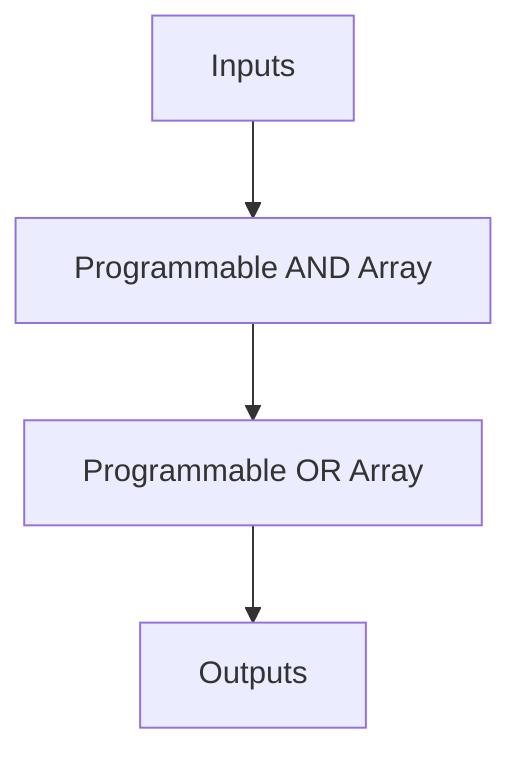

---

#### **Q2) What is the difference between PAL and PLA?**

|**Feature**|**PLA**|**PAL**|
|---|---|---|
|**Flexibility**|Both AND and OR arrays are programmable.|Only the AND array is programmable.|
|**Speed**|Slower due to higher flexibility.|Faster due to fixed OR array.|
|**Cost**|Higher due to complexity.|Lower due to simplicity.|
|**Applications**|Complex logic designs.|Simple logic designs.|

---

#### **Q3) Implement the Boolean function F(A, B, C, D) = Σm(0, 1, 3, 15) using PAL.**

- **Approach**:
    - Minimize the Boolean expression using a Karnaugh map.
    - Use the PAL structure to implement the simplified expression.

**Diagram**:

```mermaid
graph TD
    A[Inputs (A, B, C, D)] --> B[AND Gates]
    B --> C[Fixed OR Array]
    C --> D[Output F]
```

---

### **2. ASM Charts**

#### **Q4) What is an ASM Chart? Explain its components.**

- **Definition**:  
    An Algorithmic State Machine (ASM) Chart is a graphical representation of sequential logic that describes the behavior of digital systems.
    
- **Components**:
    
    1. **State Boxes**: Represent the states of the system.
    2. **Decision Boxes**: Represent conditional transitions between states.
    3. **Conditional Outputs**: Indicate outputs based on states and conditions.

**Diagram**:

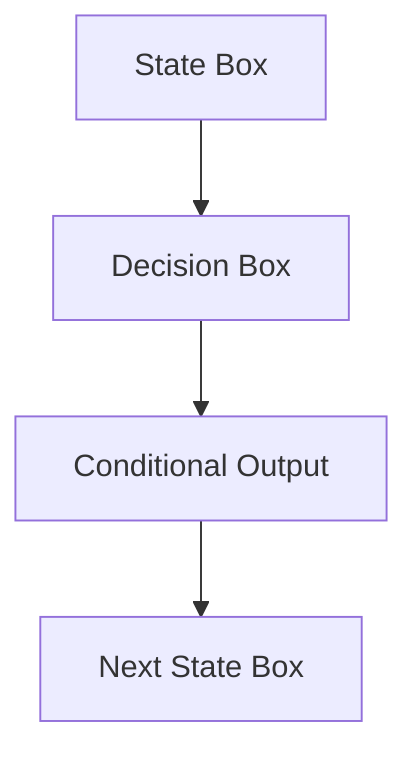

---

#### **Q5) Draw an ASM Chart for a 2-bit UP Counter with Enable (E).**

- **Explanation**:
    - The counter increments when E=1E = 1; otherwise, it holds the current state.

**ASM Chart**:

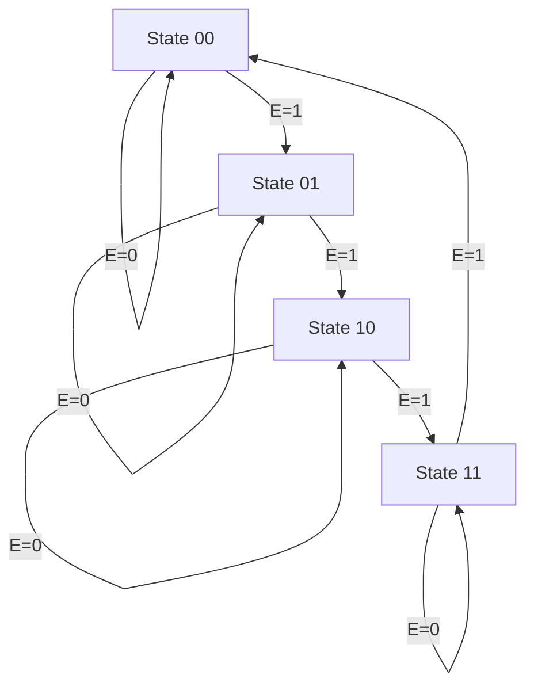

---

### **3. Logic Families**

#### **Q6) Compare TTL and CMOS logic families.**

|**Feature**|**TTL**|**CMOS**|
|---|---|---|
|**Power Dissipation**|High|Low|
|**Speed**|Faster|Moderate|
|**Noise Margin**|Moderate|High|
|**Fan-Out**|Limited (10)|Higher (50)|
|**Operating Voltage**|5V|3V to 15V|

---

#### **Q7) Explain the working of a 2-input TTL NAND Gate.**

- **Explanation**:  
    A TTL NAND gate uses multiple transistors to produce a logic NAND operation. When both inputs are high, the output is low. For other input combinations, the output is high.

**Diagram**:

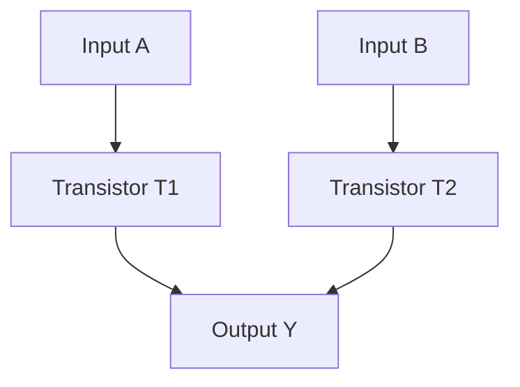

---

### **4. CMOS Technology**

#### **Q8) Draw and explain the circuit diagram of a CMOS Inverter.**

- **Explanation**:  
    A CMOS Inverter consists of a PMOS and NMOS transistor. When the input is high, the NMOS conducts, pulling the output low. When the input is low, the PMOS conducts, pulling the output high.

**Diagram**:

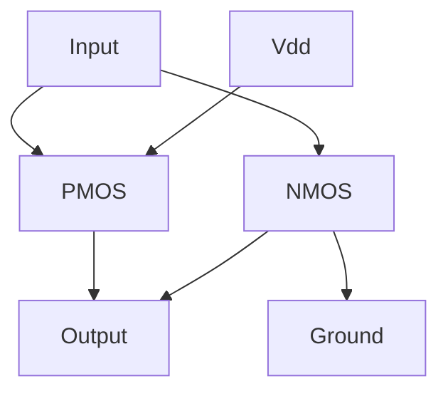

---

### **5. Microprocessor Basics**

#### **Q9) What is a microprocessor? Explain the system bus structure.**

- **Definition**:  
    A microprocessor is an integrated circuit that performs the functions of a CPU, including arithmetic, logic, control, and data transfer.
    
- **System Bus**:
    
    1. **Data Bus**: Transfers data between CPU and memory/I/O devices.
    2. **Address Bus**: Carries memory addresses.
    3. **Control Bus**: Sends control signals (read/write, interrupt).

**Diagram**:

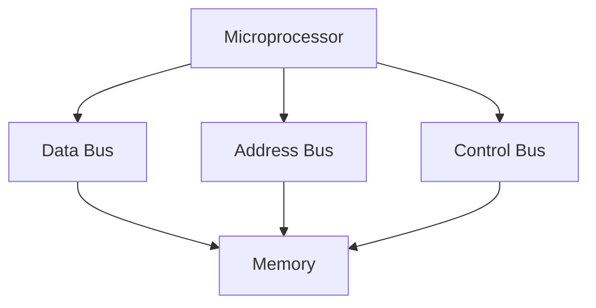

---

#### **Q10) What are the basic arithmetic operations using ALU IC 74181?**

- **Explanation**:  
    The ALU IC 74181 performs operations like addition, subtraction, AND, OR, and XOR. It accepts 4-bit inputs AA and BB and outputs the result based on control lines.

**Diagram**:

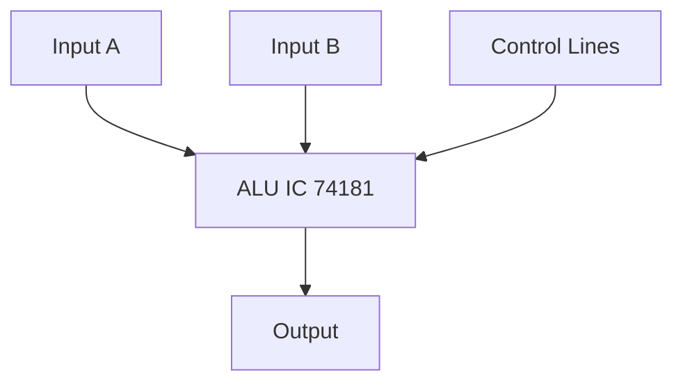

---

#### **Q11) Explain memory organization in a microprocessor.**

- **Explanation**:
    - Memory is divided into **addressable units**. The microprocessor uses an **address bus** to select the location and a **data bus** to read/write data.
    - Registers are used for temporary data storage.

**Diagram**:

```mermaid
graph TD
    A[Microprocessor] --> B[Address Bus]
    B --> C[Memory Address]
    A --> D[Data Bus]
    D --> C
```

---

This comprehensive Q&A covers **Programmable Devices, ASM Charts, Logic Families, CMOS Technology**, and **Microprocessor Concepts** with proper explanations, tables, and diagrams. Let me know if you need further details or expansions!


### **Extended Q&A on Topics**

Here are **additional questions and answers** from the topics mentioned, with detailed explanations and diagrams.

---

### **1. Programmable Devices (PLA, PAL)**

#### **Q12) Explain the structure of a PAL.**

- **Explanation**:  
    A **Programmable Array Logic (PAL)** device has a programmable AND array and a fixed OR array. This structure simplifies the design process for combinational logic circuits.

**Diagram**:

```mermaid
graph TD
    A[Inputs] --> B[Programmable AND Array]
    B --> C[Fixed OR Array]
    C --> D[Outputs]
```

#### **Q13) Implement the Boolean functions using PAL.**

- Given:
    
    F1(A,B,C)=Σm(0,1,3,5)F1(A, B, C) = \Sigma m(0, 1, 3, 5) F2(A,B,C)=Σm(2,4,6,7)F2(A, B, C) = \Sigma m(2, 4, 6, 7)
- **Steps**:
    
    1. Minimize the expressions for F1F1 and F2F2.
    2. Map the simplified expressions to the PAL structure.

---

### **2. ASM Charts**

#### **Q14) Design an ASM Chart for a 3-bit Up/Down Counter.**

- **Explanation**:
    - The counter increments or decrements based on a control signal.
    - When Up=1Up = 1, the counter counts upward.
    - When Up=0Up = 0, the counter counts downward.

**ASM Chart**:

```mermaid
graph TD
    A[State 000] -->|Up=1| B[State 001]
    B -->|Up=1| C[State 010]
    C -->|Up=1| D[State 011]
    D -->|Up=1| E[State 100]
    E -->|Up=1| F[State 101]
    F -->|Up=1| G[State 110]
    G -->|Up=1| H[State 111]
    H -->|Up=1| A
    A -->|Up=0| H
    H -->|Up=0| G
    G -->|Up=0| F
    F -->|Up=0| E
    E -->|Up=0| D
    D -->|Up=0| C
    C -->|Up=0| B
    B -->|Up=0| A
```

---

### **3. Logic Families**

#### **Q15) What is a Wired AND Connection in TTL Logic?**

- **Explanation**:  
    In TTL logic, a **Wired AND** connection is created by connecting the open-collector outputs of multiple gates. The resulting logic is an AND operation.

**Diagram**:

```mermaid
graph TD
    A[Output 1] --> B[Open Collector Gate]
    C[Output 2] --> B
    B --> D[AND Output]
```

#### **Q16) Explain the concept of Tri-State Logic in TTL.**

- **Explanation**:  
    A tri-state device has three possible output states:
    1. **High (1)**.
    2. **Low (0)**.
    3. **High Impedance (Z)**: Disconnects the output, allowing multiple devices to share a bus.

**Applications**:

- Bus systems in microprocessors.
- Memory interfacing.

---

### **4. CMOS Technology**

#### **Q17) Compare CMOS and BiCMOS technologies.**

|**Feature**|**CMOS**|**BiCMOS**|
|---|---|---|
|**Power Dissipation**|Low|Moderate|
|**Speed**|Moderate|High|
|**Integration**|High|High|
|**Applications**|Digital logic circuits|High-speed applications|

#### **Q18) Explain the operation of a CMOS NOR Gate.**

- **Explanation**:  
    A CMOS NOR gate uses complementary PMOS and NMOS transistors.
    - When both inputs are low, PMOS conducts, and the output is high.
    - When either or both inputs are high, NMOS conducts, and the output is low.

**Diagram**:

```mermaid
graph TD
    A[Input A] --> B[PMOS1]
    C[Input B] --> D[PMOS2]
    B --> E[Output]
    D --> E
    A --> F[NMOS1]
    C --> G[NMOS2]
    F --> H[Ground]
    G --> H
    F --> E
    G --> E
```

---

### **5. Microprocessor Basics**

#### **Q19) Explain the operations of a microprocessor.**

- **Operations**:
    1. **Fetch**: The instruction is fetched from memory.
    2. **Decode**: The instruction is decoded to identify the operation.
    3. **Execute**: The microprocessor performs the specified operation using the ALU and registers.
    4. **Write Back**: The result is stored back in memory or a register.

**Diagram**:

```mermaid
graph TD
    A[Instruction in Memory] --> B[Fetch]
    B --> C[Decode]
    C --> D[Execute]
    D --> E[Write Back]
```

#### **Q20) Explain the purpose of the control bus in a microprocessor.**

- **Control Bus**:
    - Carries control signals like **Read/Write**, **Interrupt**, and **Clock**.
    - Coordinates communication between the CPU, memory, and I/O devices.

**Diagram**:

```mermaid
graph TD
    A[Microprocessor] --> B[Control Bus]
    B --> C[Memory]
    B --> D[Input-Output Devices]
```

---

### **6. Microprocessor ALU**

#### **Q21) Explain the working of ALU IC 74181.**

- **Explanation**:
    - The IC 74181 is a 4-bit Arithmetic Logic Unit capable of performing 16 arithmetic and 16 logic functions.
    - It has two 4-bit inputs AA and BB, and the output is determined by the control lines.

**Diagram**:

```mermaid
graph TD
    A[Input A] --> B[ALU 74181]
    C[Input B] --> B
    D[Control Lines] --> B
    B --> E[Output]
```

#### **Q22) How does the ALU perform addition and subtraction?**

- **Addition**:
    - The ALU adds AA and BB using a full-adder circuit.
- **Subtraction**:
    - BB is complemented, and A+B‾+1A + \overline{B} + 1 is performed using the same full-adder.

---

### **7. Microprocessor Memory Organization**

#### **Q23) How is memory organized in a microprocessor system?**

- **Explanation**:
    - Memory is divided into:
        1. **Primary Memory**: RAM and ROM.
        2. **Secondary Memory**: Hard drives, SSDs.
    - Address Bus specifies the memory location.
    - Data Bus transfers the data.

**Diagram**:

```mermaid
graph TD
    A[Microprocessor] --> B[Address Bus]
    B --> C[Memory Module]
    C --> D[Data Bus]
    D --> A
```

---

This extended Q&A provides a detailed set of questions and answers on **Programmable Devices, ASM Charts, Logic Families, CMOS Technology**, and **Microprocessor Basics**. Let me know if further expansions are needed!